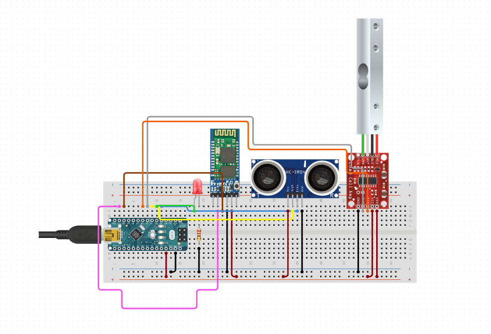

# bin-indicator
A system that monitors a trash bin, based on Arduino

The heart of the system will be an [Arduino Nano](https://www.optimusdigital.ro/ro/compatibile-cu-arduino-nano/1686-placa-de-dezvoltare-compatibila-cu-arduino-nano-atmega328p-i-ch340.html?search_query=Placa%20arduino&results=234&fbclid=IwAR3gqeLrzSv61Wf8m_Q8j9DJ0RHo3gY0iV65b8kW1_z283A-a1JWMej9cto). We chose this microcontroller for it's small footprint.

Sensors:
* [Weigth sensor](https://www.optimusdigital.ro/ro/altele/5576-celula-de-sarcina-de-1-kg-cu-amplificator-hx711.html?search_query=Hx711&results=10&fbclid=IwAR0UPj_Mwoj8D1WlsWutQrSDdwTrG2QrdPuZh5xcN5-WcyQr0EdVLqZEA5c)
* [Distance sensor](https://www.optimusdigital.ro/ro/senzori-senzori-ultrasonici/9-senzor-ultrasonic-hc-sr04-.html?search_query=senzor+ultrasonic&results=22)

The rest of the system will be made out of:

* A small [breadboard](https://www.optimusdigital.ro/ro/prototipare-breadboard-uri/244-mini-breadboard-colorat.html?search_query=Breadboard&results=100&fbclid=IwAR0GgCKwaVqmPJdXozJG8Vr45aaPVSifH3mAXYyDcXmoDcy15S6hs77Jt64) for testing
* A [bluetooth](https://ardushop.ro/ro/home/132-modul-bluetooth-hc-06-cu-3-pini.html?fbclid=IwAR3mpCDpi1ofrMaBS5AqHEG6cYTtvZ6LaRsf2Yb83EV5uSn5qZ7Sm81lxnE) adapter to communicate to a smartphone for monitoring and statistics
* Various cables and [extenstions](https://www.optimusdigital.ro/ro/fire-fire-mufate/897-cablu-4p-de-70-cm.html?search_query=cablu&results=647&fbclid=IwAR318Woo957hc44h5iZwvr31kOWAeu56TlaIb1-bjrC5yq8Nb6IYewJLw6Q)

Schematic of the hardware layout:

